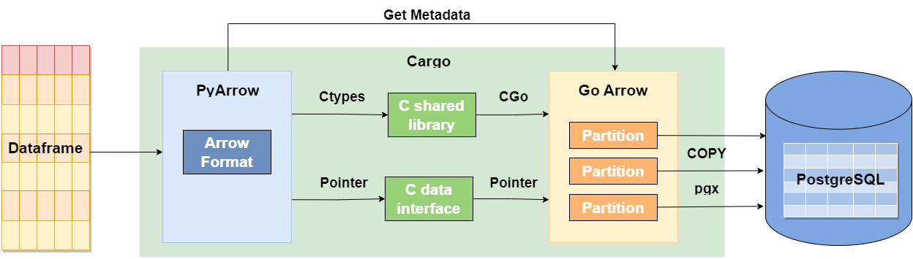
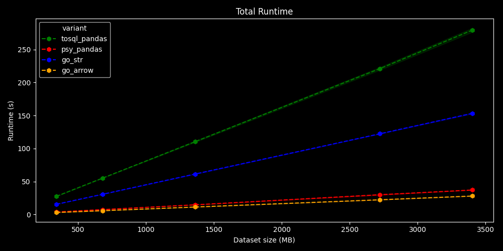
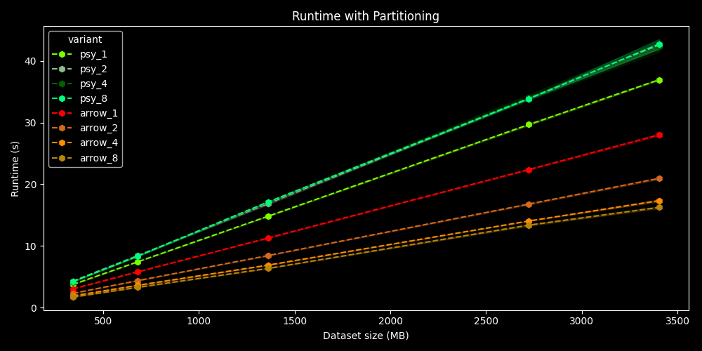
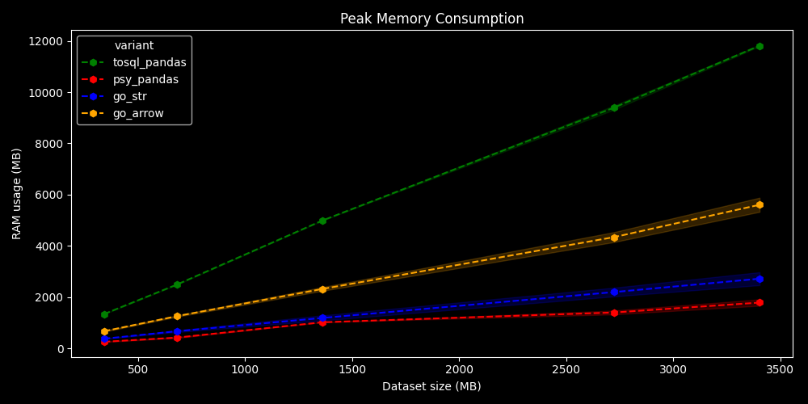
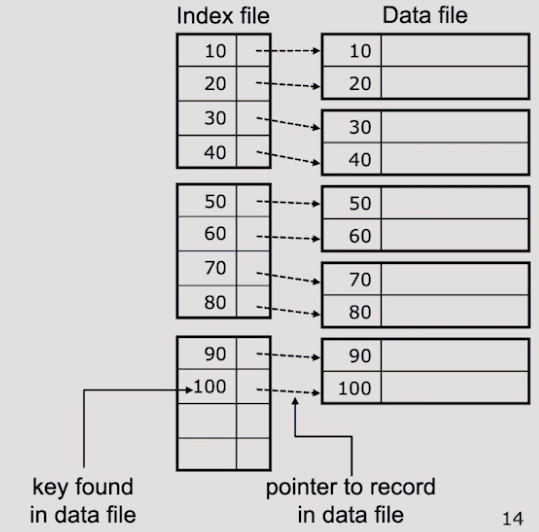
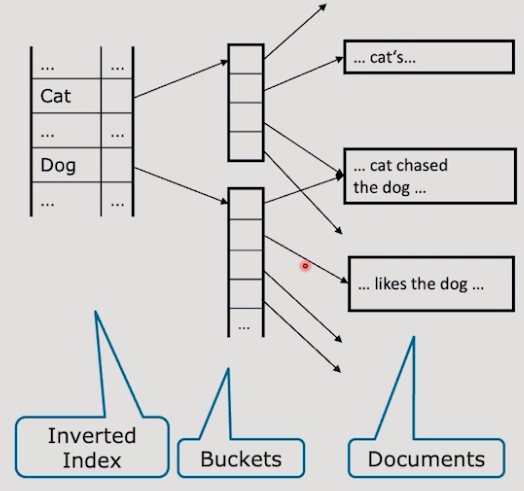

# Thirteen month series 

Each month is a seperated project/course inspired by HPI seminar/courses.

## Structure
1. [Silver January - Cargo: Efficient writing of dataframes to Postgres with Go](#silver-january) - **Interoperability in Data Processing Pipelines - HPI**
2. [White February - Search Engine: Inverted Index and TF-IDF in Go](#white-february) - **Big Data Systems - HPI**

## Silver January
This project is a part of **Cargo: Efficient writing of dataframes to a Postgres database** 

**Cargo** is a seminar project from **Interoperability in Data Processing Pipelines - Hasso Plattner Institute**.

### Motivation
* `to_sql` is a common step in data science pipelines, but existing solutions are slow and cost a lot of memory
* The paper [ConnectorX: Accelerating Data Loading From Databases to
  Dataframes](https://www.vldb.org/pvldb/vol15/p2994-wang.pdf) speeds up loading process from database to pandas by using `Rust` binding and data partitioning
* We try to reverse the process using `Go` binding and `Goroutines` as data partitioning to speed up writing process from pandas to database

### Architecture

We convert the Pandas Dataframe into Arrow format using `pyarrow.Table.from_pandas()` and then passing the pointer
to the Arrow data to Go using `Ctypes` shared library and `The Arrow C data interface`.

We also use `COPY` command and fastest Go Postgres Driver `pgx`.

For the data partitioning, each `goroutine` will construct, hold the same amount of data, open multiple connection and write data to the database in parallel.

### Evaluation

All solutions are faster than Pandas:
* `Go Arrow`: 10x 
* `Psy`: 7.5x
* `Go CString`: 1.8x

`Go Arrow` is my solution, `Psy` and `Go CString` are my teammates solutions.

With 8 partitions (8 goroutines), `Go Arrow` has more 1.72x improvement (total 17.2x)

My solution also consume 2.1x less memory usage than Pandas (but worse than friends' solutions)

## White February
This project was inspired by **Big Data Systems** course from HPI.

### Inverted Index

**Indexes** is  a data structure to find data item quickly.
* Key -> Data
* Often unique key

Typical examples:
* Binary tree
* Hash table
* B-tree

In a **search engine**:
* Find document that contains word(s)
* Data -> Key
* -> **Inverted Index**

Consider a text document collection as a relation
* Each word in the text collection is a boolean attribute
* An attribute is true if the documents contains the word anywhere
* Document(hadCat,hasDog,hasHouse,...)

**Inverted Index**:
* Build a secondary index on every attribute (word)
* But: Only true values are indexed
* Build index pointing from word to secondary index for that word

Extension:
* Combine with document markup: title, abstract, body, anchor, header,...
* Store position of word

* Pointers in bucket
  * To a document 
  * To a position in a document
* Extension:
  * Bucket does not only store position but also other metadata
  * Type (Title, Abstract, Text, Table,...)
  * Formatting (Bold, Italic, Underline,...)
* Queries: AND, OR, NOT
  * Operating on pointers sets

### Building an Inverted Index
**Input**: Collection of documents

1. **Tokenization**
   * Extract all words from each document
   * Remember the source document for each word
   * Embarassingly parallel
2. **Inversion**
   * Merge word lists and collect pointers to documents per unique words
   * Need data exchange

### TF-IDF
In information retrieval, **TF-IDF**, short for term frequency–inverse document frequency, is a numerical statistic that is intended to reflect how important a word is to a document in a collection or corpus.

* **Term Frequency** (TF)
  * How often does a word occur in a document?
  * TF = Number of occurrences of a word in a document / Total number of words in the document
* **Inverse Document Frequency** (IDF)
  * IDF = log(Total number of documents / Number of documents with term t in it)
* **TF-IDF** = TF * IDF